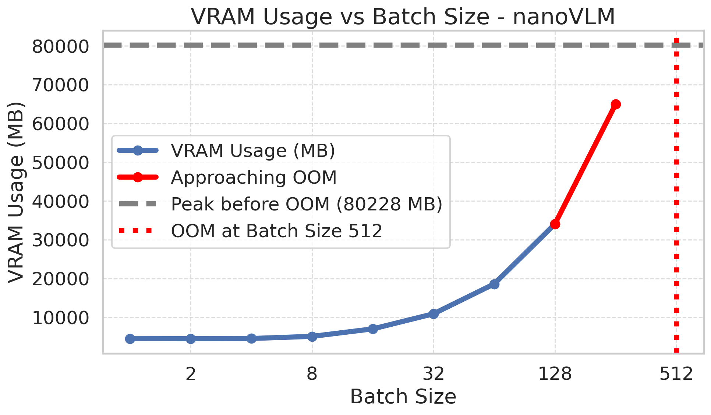

# nanoVLM


<a target="_blank" href="https://colab.research.google.com/github/huggingface/nanoVLM/blob/main/nanoVLM.ipynb">
  
</a>  

nanoVLM is the simplest repository for training/finetuning a small sized Vision-Language Model with a lightweight implementation in pure PyTorch. The code itself is very readable and approachable, the model consists of a Vision Backbone (`models/vision_transformer.py` ~150 lines), Language Decoder (`models/language_model.py` ~250 lines), Modality Projection (`models/modality_projection.py` ~50 lines) and the VLM itself (`models/vision_language_model.py` ~100 lines) and a simple training loop (`train.py` ~200 lines).

Similar to Andrej Karpathy's nanoGPT, we wanted to equip the community with a very simple implementation and training script for Vision Language Models. We do not claim this to be a new SOTA model, rather an educational effort that packs quite a bit of punch if you have the right hardware! You should be able to tweak and play around with the code in no time.


## What can nanoVLM do?

The model definition and training logic of this repository fits in ~750 lines, with some more boilerplate logging and parameter loading. 
Using the [`SigLIP-B/16-224-85M`](https://huggingface.co/google/siglip-base-patch16-224) and [`HuggingFaceTB/SmolLM2-135M`](https://huggingface.co/HuggingFaceTB/SmolLM2-135M) as backbones results in a **222M** nanoVLM. Training this for ~6h on a single H100 GPU on ~1.7M samples of [the cauldron](https://huggingface.co/datasets/HuggingFaceM4/the_cauldron) results in an accuracy of 35.3% on MMStar.


It is therefore a simple yet powerful platform to get started with VLMs. Perfect to tinker around with different setups and settings, to explore the capabilities and efficiencies of small VLMs!

## Quick Start

You can either clone the repository, setup an environment and start with the scripts, or directly [open in Colab](https://colab.research.google.com/github/huggingface/nanoVLM/blob/main/nanoVLM.ipynb). You can also use the [interactive notebook](./nanoVLM.ipynb) to get started!


## Environment Setup

We really like `uv` and recommend using it as your package manager. But feel free to use whichever you prefer.

Let's first clone the repository:
```bash
git clone https://github.com/huggingface/nanoVLM.git
cd nanoVLM
```

If you want to use `uv`:
```bash
uv init --bare
uv sync --python 3.12
source .venv/bin/activate
uv add torch numpy torchvision pillow datasets huggingface-hub transformers wandb
```

If you prefer another environment manager, simply install these packages:  
```bash
pip install torch numpy torchvision pillow datasets huggingface-hub transformers wandb
```
Dependencies: 
- `torch` <3
- `numpy` <3
- `torchvision` for the image processors
- `pillow` for image loading
- `datasets` for the training datasets
- `huggingface-hub` & `transformers` to load the pretrained backbones
- `wandb` for logging

## Training

To train nanoVLM, you can simply use the provided training script
```bash
wandb login --relogin
python train.py
```
which will use the default `models/config.py`.

## Generate

To try a [trained model](https://huggingface.co/lusxvr/nanoVLM-222M), you can simply use the provided generate script
```bash
python generate.py
```

If we feed the example image in `assets/image.png` with a question into the model, we get the following output. Even after only short training, the model can recognize the cat in the picture. 
```
Input: 
Image + 'What is this?'
Output:
Generation 1:  This is a cat sitting on the floor. I think this is a cat sat facing towards the left
Generation 2:  The picture contains a white and brown cat sitting on the floor, platform, it is measuring 1
Generation 3:  This is a cat which is sitting on the floor of the house. This cat wore a black and
Generation 4:  This is a cute cat sitting on the surface of the mat. The background, which is blur,
Generation 5:  This is a cat sitting on a rug, which is on the ground. The cat is in brown
```

## Hub integration

**nanoVLM** comes with handy methods to load and save the model from the Hugging Face Hub.

### Pretrained weights

Here is how to load from a repo on the Hugging Face Hub. This is the recommended way to start working with the pretrained weights.

```python
# Load pretrained weights from Hub
from models.vision_language_model import VisionLanguageModel

model = VisionLanguageModel.from_pretrained("lusxvr/nanoVLM-222M")
```

### Push to hub

Once you've trained a **nanoVLM** model, you might want to share it on the Hugging Face Hub. You can easily do that with:

```python
... # Load and train your model

# Push it to `username/my-awesome-nanovlm-model` repo
model.push_to_hub("my-awesome-nanovlm-model")
```

The model will be saved on the Hub as a config file `config.json` and a weights file `model.safetensors`. A modelcard `README.md` will also be generated for you with some high-level information. Feel free to update it manually to explain your work.

If the repo does not exist, it will be created for you. By default the repo will be public. You can pass `private=True` if you don't want to share publicly.


### Local save/load

If you don't want to host your model on the Hugging Face Hub, it is still possible to save it locally:

```python
... # Load and train your model

# Save it to a local folder
model.save_pretrained("path/to/local/model")
```

You can then reload it from the local path:

```python
# Load pretrained weights from local path
from models.vision_language_model import VisionLanguageModel

model = VisionLanguageModel.from_pretrained("path/to/local/model")
```

## VRAM Usage

Understanding the VRAM requirements for training is crucial for selecting the right hardware and batch sizes. We've benchmarked the default `nanoVLM` model (222M parameters) on a single NVIDIA H100 GPU. Below is a summary of the peak VRAM usage observed for different batch sizes during training (including model, gradients, and optimizer states):



Here's a breakdown of the approximate peak VRAM usage:

```
VRAM allocated after loading model to device: 870.53 MB
--- Summary of VRAM Usage (Default Model) ---
Batch Size 1:   4439.02 MB
Batch Size 2:   4461.05 MB
Batch Size 4:   4515.27 MB
Batch Size 8:   5062.60 MB
Batch Size 16:  6989.32 MB
Batch Size 32:  10880.09 MB
Batch Size 64:  18584.00 MB
Batch Size 128: 34043.34 MB
Batch Size 256: 64944.37 MB
Batch Size 512: OOM (Peak before OOM: 80228.30 MB)
```

**Key Takeaways:**
- You'll need at least ~4.5 GB of VRAM to train the default model even with a batch size of 1.
- With approximately 8 GB of VRAM, you should be able to train with a batch size of up to 16.

**Measure for Your Setup:**

The values above are for the default model configuration. If you modify the model architecture (e.g., change backbones, hidden sizes) or use different sequence lengths, your VRAM requirements will change. 

We provide a script `measure_vram.py` that allows you to test VRAM requirements on your specific machine and for your chosen model configuration and batch sizes. 

To use it:
1. Ensure you have a CUDA-enabled GPU and PyTorch installed.
2. Run the script with your desired batch sizes. You can also specify a model checkpoint if you have one, or let it initialize a new model based on the default `VLMConfig`.

```bash
# Example: Test batch sizes 1, 2, 4, 8 with a new default model
python measure_vram.py --batch_sizes "1 2 4 8"

# Example: Test with a specific checkpoint and different batch sizes
python measure_vram.py --vlm_checkpoint_path path/to/your/model.pth --batch_sizes "16 32 64"

```

This script will output the peak VRAM allocated for each batch size tested, helping you determine feasible training configurations for your hardware.


## Contributing

We welcome contributions to nanoVLM! However, to maintain the repository's focus on simplicity and pure PyTorch, we have a few guidelines:

*   **Pure PyTorch:** We aim to keep nanoVLM as a lightweight implementation in pure PyTorch. Contributions that introduce dependencies like `transformers.Trainer`, `accelerate`, or `deepspeed` will not be accepted.
*   **New Features:** If you have an idea for a new feature, please open an issue first to discuss the scope and implementation details. This helps ensure that your contribution aligns with the project's goals.
*   **Bug Fixes:** Feel free to submit pull requests for bug fixes.

### Roadmap

Here are some areas we're looking to work on in the near future. Contributions in these areas are particularly welcome:

*   **Data Packing:** Implementing a way to create packs of a given size from the input data to optimize training.
*   **Multi-gpu training:** Training on several GPUs
*   **Multi-image support:** Training with several images
*   **Image-splitting:** Enabling higher resolutions through image-splitting as done in SmolVLM.
*   **VLMEvalKit:** Integration into [VLMEvalKit](https://github.com/open-compass/VLMEvalKit) to enable further benchmarks

## Citation

If you like the project and want to use it somewhere, please use this citation:
```
@misc{wiedmann2025nanovlm,
  author = {Luis Wiedmann and Aritra Roy Gosthipaty and Andrés Marafioti},
  title = {nanoVLM},
  year = {2025},
  publisher = {GitHub},
  journal = {GitHub repository},
  howpublished = {\url{https://github.com/huggingface/nanoVLM}}
}
```