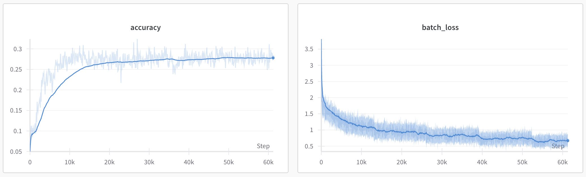

# nanoVLM


<a target="_blank" href="https://colab.research.google.com/github/huggingface/nanoVLM/blob/main/nanoVLM.ipynb">
  
</a>  

nanoVLM is the simplest repository for training/finetuning a small sized Vision-Language Model with a lightweight implementation in pure PyTorch. The code itself is very readable and approachable, the model consists of a Vision Backbone (`models/vit.py` ~150 lines), Language Decoder (`models/lm.py` ~250 lines), Modality Projection (`models/mp.py` ~50 lines) and the VLM itself (`models/vlm.py` ~100 lines) and a simple training loop (`train.py` ~200 lines).

### What can nanoVLM do?
The model definition and training logic of this repository fits in ~750 lines, with some more boilerplate logging and parameter loading. 
Using the SigLIP-B/16-512-86M and SmolLM2-135M as backbones results in a 256M nanoVLM. Training this for ~12h on a single H100 GPU on ~1.7M samples of [the cauldron](https://huggingface.co/datasets/HuggingFaceM4/the_cauldron) results in an accuracy of ~28% on MMStar.



It is therefore a simple but yet powerful platform to get started with VLMs. Perfect to tinker around with different setups and setting, to explore the capabilities and efficiencies of small VLMs!

## Quick Start
If you don't want to do any setup at all, you can run the whole think in Google Colab! Just press the "Open in Colab" button or open `nanoVLM.ipynb` to get started!  

## Environment Setup

Simply install these packages in your favourite environment manager
```bash
pip install torch datasets wandb
```

## Training

To train nanoVLM, you can simply use the provided training script
```bash
python train.py
```
which will use the default `models/config.py`.

## Generate

To try a trained model, you can simply use the provided generate script
```bash
python generate.py
```
